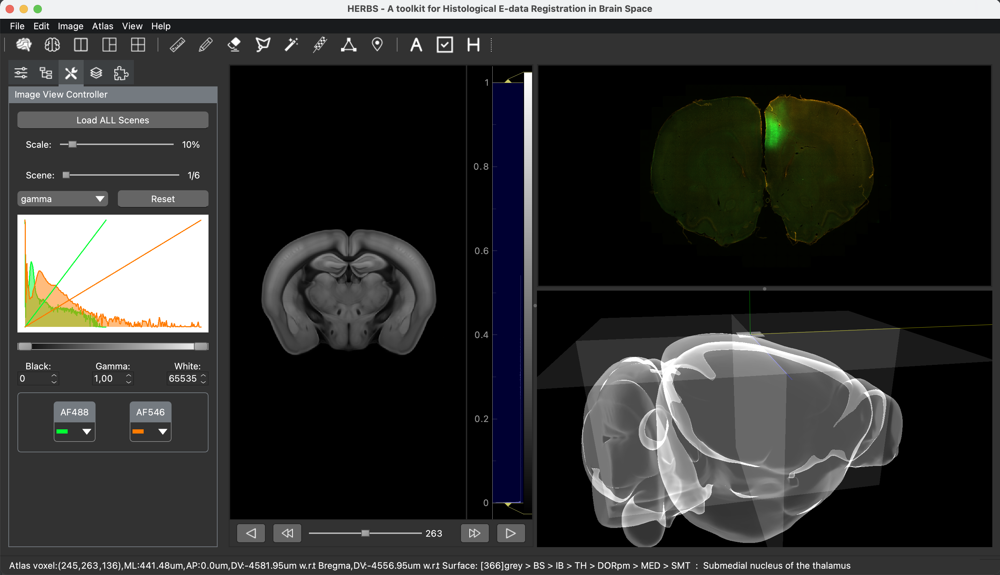

# DriftlessMap

Interactive histology registration and brain-atlas mapping.

DriftlessMap is an open-source desktop application for registering histological
images to reference brain atlases, reconstructing probes and other anatomical
objects, and visualizing data in 2D and 3D. The name refers to Wisconsin's
Driftless Area and to the project's focus on dependable spatial mapping.

## Origin and independence

DriftlessMap began as a fork of
[HERBS](https://github.com/Whitlock-Group/HERBS) — Histological E-data
Registration in rodent Brain Spaces — originally created by Jingyi Guo
Fuglstad, Pearl Saldanha, Jacopo Paglia, Jonathan R. Whitlock, and HERBS
contributors.

DriftlessMap is independently maintained. It is not affiliated with or endorsed
by the original HERBS developers. Their foundational work remains credited in
the Git history, [license](LICENSE.txt), [project history](ORIGINS.md),
[contributors](CONTRIBUTORS.md), [authors](AUTHOR.txt), and
[acknowledgements](THANKS.txt).

Current development is led by
[Mohebi & Associates](https://www.mohebi-associates.org/), with
[Ali Mohebi](https://www.mohebial.com/) as project lead and maintainer.

If DriftlessMap contributes to published research, please cite both the software
version used and the original HERBS paper:

> Fuglstad, J. G., Saldanha, P., Paglia, J., & Whitlock, J. R. (2023).
> Histological E-data Registration in rodent Brain Spaces. *eLife*, 12,
> e83496. https://doi.org/10.7554/eLife.83496

See [CITATION.cff](CITATION.cff) for machine-readable citation metadata.

## Features

- 2D and 3D visualization of volumetric brain atlases and arbitrary slices.
- Interactive histology-to-atlas registration with local elastic deformation.
- Probe planning, reconstruction, contact mapping, and CSV export.
- Drawing, cell, virus-expression, and user-defined object workflows.
- Safe, versioned project and object archives.
- Support for custom compatible atlases.

## Installation

DriftlessMap 1.4.0 is available as a desktop application for end users and as
a Python package for developers.

### Mode 1: desktop application for end users

No Python or Conda installation is required. Download the asset for your
computer from [GitHub Releases](https://github.com/mohebi-n-associates/DriftlessMap/releases):

- **Windows 64-bit:** download `DriftlessMap-1.4.0-Windows-x64.zip`, extract
  the complete folder, and double-click `DriftlessMap.exe`. Do not move the
  executable out of its extracted folder.
- **macOS:** download `DriftlessMap-1.4.0-macOS.dmg`, open it, and drag
  `DriftlessMap.app` to Applications. The application bundle includes the
  DriftlessMap icon and all Python dependencies.

Release builds are currently unsigned. If Windows SmartScreen or macOS
Gatekeeper displays a warning, verify that the file came from the official
release page. On macOS, Control-click the app, choose **Open**, and confirm the
first launch. Code signing and notarization are planned for a future release.

### Mode 2: Conda and pip for developers

DriftlessMap supports Python 3.10–3.14 and Qt 6 through PyQt6. Python 3.14 is
recommended for core development:

```bash
conda create --name DriftlessMap python=3.14 -y
conda activate DriftlessMap
python -m pip install --upgrade pip
git clone https://github.com/mohebi-n-associates/DriftlessMap.git
cd DriftlessMap
python -m pip install -e ".[test]"
```

Launch the editable installation with `driftlessmap` or
`python -m driftlessmap`. Library users can call `driftlessmap.run()`.

To use the stable PyPI package instead of an editable checkout, run:

```bash
python -m pip install driftlessmap
```

#### Check your version and upgrade

Check the installed version:

```bash
python -m driftlessmap --version
```

Compare it against the latest stable release on
[PyPI](https://pypi.org/project/driftlessmap/):

```bash
pip index versions driftlessmap
```

Upgrade to the latest stable release:

```bash
python -m pip install --upgrade driftlessmap
```

#### Zeiss CZI files

CZI support uses the optional `aicspylibczi` package, whose prebuilt packages
currently support Python through 3.13:

```bash
conda create --name DriftlessMap-CZI python=3.13 -y
conda activate DriftlessMap-CZI
python -m pip install --upgrade pip
python -m pip install "driftlessmap[czi]"
```

#### Building the desktop applications

Native applications must be built on their target operating system. The
release workflow builds both platforms automatically; maintainers can also run
`packaging/build_windows.ps1` on Windows or `packaging/build_macos.sh` on
macOS. Outputs are written to `dist/` as a Windows ZIP and a macOS DMG.

## Compatibility with HERBS

The rebrand is designed not to strand existing research data:

- DriftlessMap reads legacy `.herbs`, `.herbslayer`, `.herbsobj`,
  `.herbsslice`, and `.herbstri` files.
- New files use `.dmap`, `.dmaplayer`, `.dmapobj`, `.dmapslice`, and
  `.dmaptri`.
- DriftlessMap installs only the `driftlessmap` Python package and command. It
  does not overwrite the original HERBS package, so both distributions can be
  installed in the same environment. New code should use `import driftlessmap`.
- Existing `HERBS_CONFIG_DIR` overrides remain supported. New configurations
  should use `DRIFTLESSMAP_CONFIG_DIR`.
- Some persisted coordinate field names retain `herbs` because changing them
  would break existing datasets and downstream analysis scripts.

The original HERBS application may not be able to open files newly written by
DriftlessMap. Keep backups before converting important projects.

## Documentation

Read the [DriftlessMap User Manual](MANUAL.md) for installation, atlas,
registration, reconstruction, persistence, export, and troubleshooting
guidance. The original [HERBS Cookbook](CookBook.pdf) and [tutorials](Tutorial)
remain useful for workflows whose interface has not changed.

The screenshot below is retained from HERBS for historical workflow reference;
its title bar predates the DriftlessMap rebrand.



Do not store downloaded atlases inside the source or installed package
directory. Keep each atlas in its own external folder.

See [What’s New in DriftlessMap](WhatsNew.md) for release history and migration
notes.

## License

DriftlessMap is distributed under the MIT License. The original HERBS copyright
and permission notice are preserved, and a separate copyright notice covers
subsequent DriftlessMap modifications. See [LICENSE.txt](LICENSE.txt) and
[ORIGINS.md](ORIGINS.md).

Please report issues or start discussions at
<https://github.com/mohebi-n-associates/DriftlessMap>.
