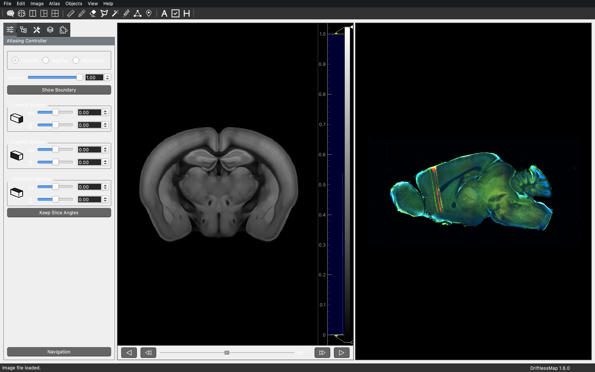
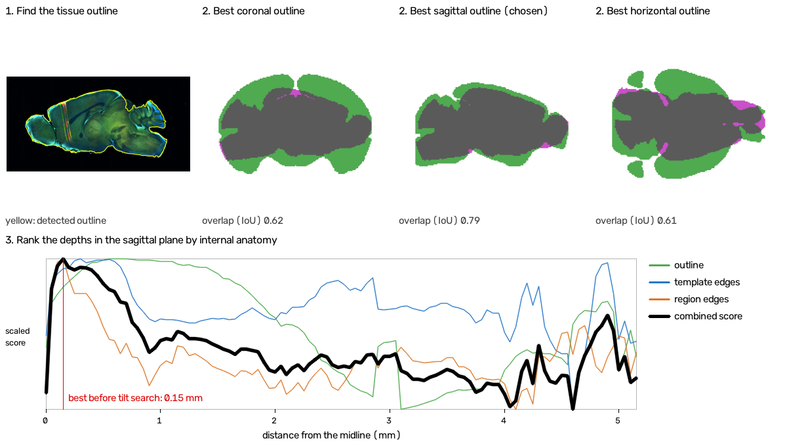
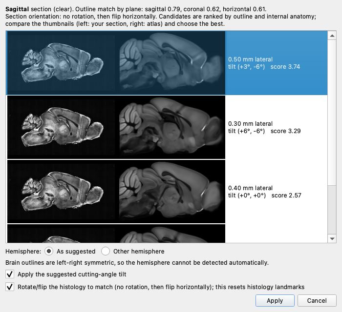
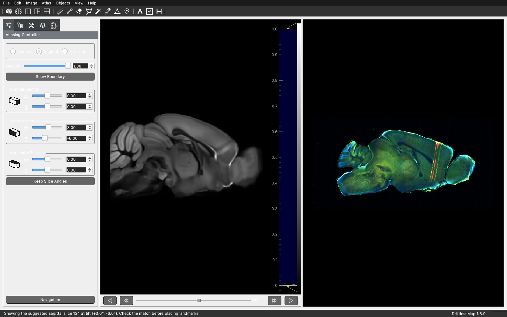
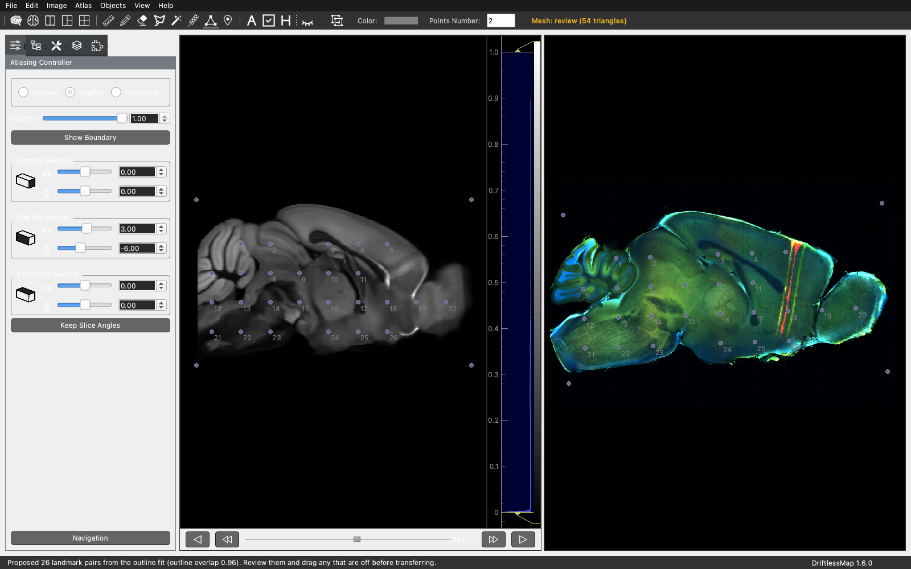
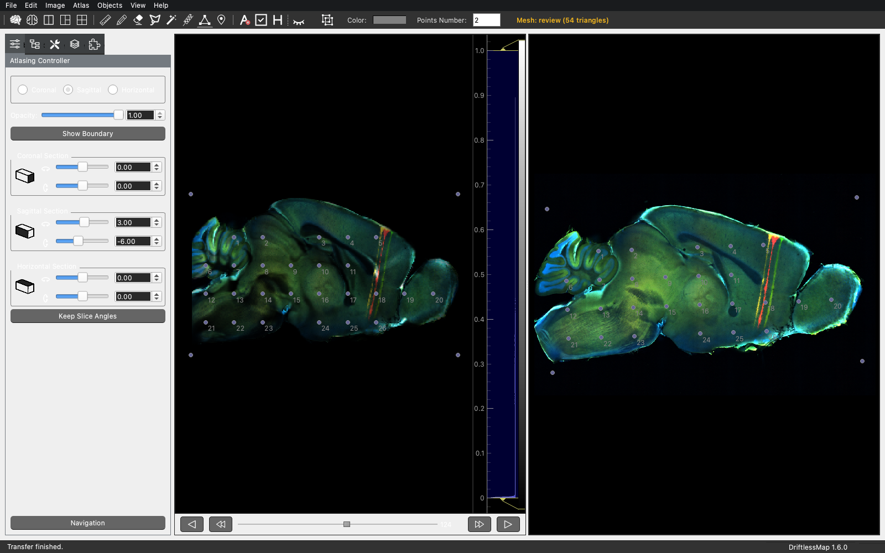
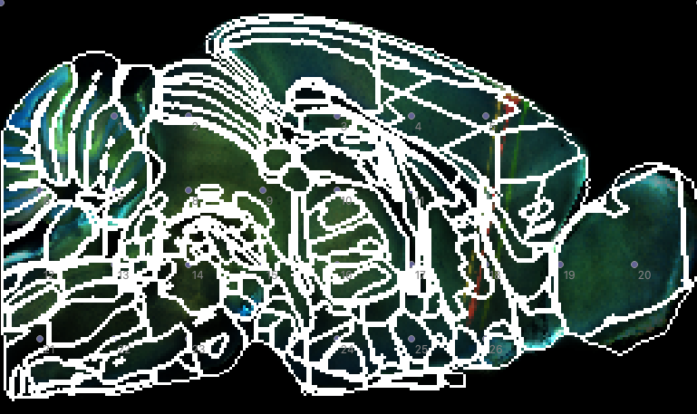

## Automatic Section Matching and Landmark Proposal

DriftlessMap 1.6 can suggest a starting point for registering a histological
section to a volume atlas. It does this in two steps:

- **Atlas > Suggest Atlas Section...** finds the atlas plane, depth, cutting
  angle and image orientation that best match the section.
- **Atlas > Propose Landmarks** fits the chosen atlas slice to the section and
  fills in the Triangulation tool with landmark pairs.

Both steps only suggest. You confirm the section, review the landmarks, and
nothing is transferred until you ask for it.

This tutorial uses a single sagittal mouse section with the Allen mouse atlas
at 50 µm. The User Manual has the reference description in
[Section 8.2](../../MANUAL.md#82-suggest-the-section-and-landmarks-automatically).

### Before you start

The automation works best on:

- one whole section per image, on a plain dark or light background;
- tissue that is mostly intact, without large tears, folds or missing pieces;
- an image cropped to roughly the section, without labels or scale bars.

The section outline is found by thresholding, so debris, bubbles or a second
section in the image will change the outline that is compared.

### 1. Load the atlas and the section

Load the processed volume atlas (**File > Load Atlas**) and the section
(**File > Load Image**). The section does not need to be rotated or flipped
first, and the atlas can show any plane.

Here the atlas is showing a coronal slice. The section is sagittal, with the
olfactory bulb on the left, while the atlas shows anterior on the right.

### 2. How the section is found

Choose **Atlas > Suggest Atlas Section...**. The comparison runs in the
background and takes a few seconds with a 50 µm atlas. It has three stages,
shown below for the sample section.

**Stage 1: the plane, from the outline.** DriftlessMap finds the tissue
outline (yellow, top left). It then scales every atlas slice of every plane to
a common size and compares its outline with the section's. Each comparison is
tried in all eight rotations and flips of the section. The score is the
overlap of the two outlines (intersection over union; 1.0 means identical). In
the panels, grey is where both outlines overlap, magenta is section only and
green is atlas only.

The sagittal plane wins clearly: its best outline overlaps 0.79, against 0.62
for coronal and 0.61 for horizontal. The dialog calls the plane **clear** when
the winner leads by at least 0.08, **uncertain** when it leads by 0.03 to
0.08, and **ambiguous** below that. Check the plane yourself whenever it is
not clear.

**Stage 2: the depth, from internal anatomy.** Neighbouring slices have
nearly the same outline. In the plot, the outline score (green) is almost
flat over the first millimetre from the midline, so the outline alone cannot
pick the depth. For every slice in the chosen plane, DriftlessMap therefore
fits the section outline onto the atlas outline and compares what is inside:

- the edges in the section against the edges in the atlas template (blue);
- the edges in the section against the atlas region boundaries (orange).

These three measures are combined into one score (black). For a sagittal
section only one hemisphere is searched, because the other hemisphere mirrors
it. On the sample, the combined score peaks 0.15 mm from the midline.

**Stage 3: the cutting angle.** Sections are rarely cut exactly along an
atlas plane. The four best, well-separated depths are therefore re-scored at
tilts of −6°, −3°, 0°, +3° and +6° about both axes of the plane. On the
sample, the best match after this search is 0.50 mm lateral, tilted
(+3°, −6°). The small tilt improved the match enough to move the best depth.

### 3. Choose the section

The dialog lists up to six candidates, best first. Each row shows your section
on the left and the atlas on the right, together with the depth, the tilt and
the combined score.

1. Compare the thumbnails and select the candidate that matches best. The
   scores rank candidates within this search; they are not probabilities.
2. **Hemisphere**: brain outlines are left-right symmetric, so the hemisphere
   cannot be detected. Choose **Other hemisphere** if the section comes from
   the other side. The depth, tilt and orientation are mirrored to match.
3. **Apply the suggested cutting-angle tilt**: leave this on to use the tilt,
   or turn it off to show the untilted slice.
4. **Rotate/flip the histology to match**: leave this on to orient the image
   to the atlas. Here the section only needs a horizontal flip. Rotating or
   flipping the histology resets its landmarks.
5. Press **Apply**.

DriftlessMap switches to the sagittal plane and shows the chosen slice. It
enters the tilt in the Sagittal Section controls and flips the histology. The
status bar confirms what was applied.

Compare the two views before going on. If the match is poor, run the
suggestion again and pick another candidate, or adjust the slice and tilt by
hand as usual.

### 4. Propose landmarks

With the matching atlas slice on screen, choose **Atlas > Propose Landmarks**.
If there are landmarks already, DriftlessMap asks before replacing them.
Remove any transform overlay first.

The fit has two stages:

1. **Outline fit.** A first guess matches the centre and extent of the two
   outlines. It is then refined into an affine fit (scale, shear, rotation and
   shift) of the smoothed outlines.
2. **Deformable refinement.** A smooth B-spline warp is fitted on the image
   intensities using mutual information. Mutual information tolerates the
   different contrast of a stained section and the atlas template. The warp
   is kept only if it improves the intensity match without making the outline
   match noticeably worse; otherwise the outline fit is used.

DriftlessMap then places about 36 points on an even grid inside the atlas
section and maps each point into the section with the fitted transform. Points
that land off the tissue are dropped. The fixed frame points around the mesh
are carried through the same transform, so they agree with the interior
landmarks.

For the sample, the status bar reports 26 landmark pairs from the outline fit,
with an outline overlap of 0.96. Here the deformable refinement did not
improve the match, so it was not used. The Triangulation tool is switched on,
and its status shows **Mesh: review (54 triangles)**: some triangles are
narrow and worth a look (see Section 8.5 of the manual).

### 5. Review, correct and transfer

Treat the proposal as a first draft. Check each numbered pair against the
anatomy, drag any point that is off, and add points where the anatomy needs
more detail, as you would when placing landmarks by hand. Then transfer the
section to the atlas as usual.

Turn on **Show Boundary** in the Atlasing Controller to draw the atlas region
boundaries over the transferred section:

On the sample, the outline of the section follows the atlas outline closely,
and large structures such as the cortex, hippocampus and olfactory bulb fall
in about the right places. Fine boundaries, deep structures and the
cerebellar folia are only approximately aligned. Correct the landmarks there
before using the registration for quantitative work.

### When the suggestions go wrong

- **The plane is wrong or marked ambiguous.** Damaged, partial or oddly
  shaped sections can outline-match the wrong plane. Choose the plane
  yourself, set the slice by hand, and use **Propose Landmarks** from there.
- **The depth is off.** Try the other candidates in the dialog. Weak or
  uneven staining gives the internal-anatomy score less to work with.
- **The tilt looks wrong.** Apply the suggestion without the tilt, then set
  the tilt by hand. Only tilts within ±6° are searched.
- **The landmarks are badly placed.** This usually means the atlas slice
  does not match the section. Fix the slice first, then propose again.
- **Few or no landmarks are proposed.** Points that land off the tissue are
  dropped, and at least three are needed. Check that the section outline is
  clean and that the histology is oriented like the atlas.
